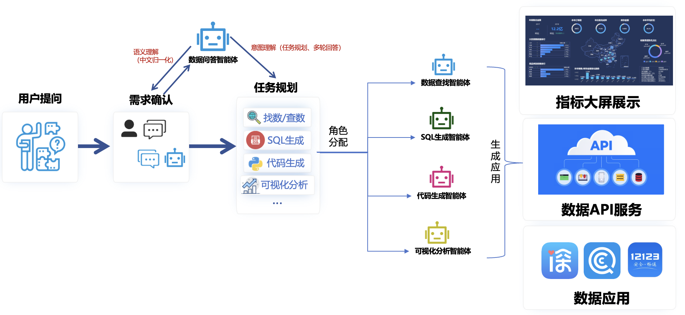

.. _header-n0:

📖 介绍
======

DataAgent是面向数据分析的多智能体，能够理解数据开发和数据分析需求、理解数据、生成面向数据查询、数据可视化、机器学习等任务的SQL和Python代码。

.. _header-n3:

特性：
------

-  **精准数据检索**\ ：DataAgent具有强大的数据处理和搜索能力，可以从成百上千张表中精准找数，满足您在大数据环境下的数据查找需求。

-  **业务知识理解**\ ：DataAgent不仅能处理数据，还深入理解数据指标、计算公式等业务知识，为您提供更深层次、更具业务价值的数据分析。

-  **多智能体协同工作**\ ：DataAgent采用面向数据分析需求的多轮对话设计，多智能体可以协同工作，进行数据分析代码的self-debug，提升分析效率，降低错误率。

-  **数据可视化**\ ：DataAgent可以将复杂的数据通过可视化的方式呈现，让数据分析结果更易于理解，帮助您更好地做出决策。

.. _header-n12:

DataAgent工作流程：
-------------------

| **1.
  需求确认：**\ DataAgent与用户建立对话，理解用户的需求。在这一阶段，DataAgent会提出一系列问题，以便更准确地了解用户的需求。
| **2.
  任务规划：**\ DataAgent会根据最终确认的需求内容为用户制定任务规划。这个规划包括一系列步骤，DataAgent会按照这些步骤来为用户提供服务。
| **3.
  任务执行：**\ DataAgent将规划好的任务分配给不同的智能体，如数据查找智能体、SQL生成智能体、代码生成智能体、可视化分析智能体等。每个智能体负责其专业领域的任务执行，协同工作以确保任务的高效完成。
| **4.应用生成：**\ DataAgent根据用户需求任务将结果数据转化为应用成果，如指标大屏展示、数据API服务和数据应用等，这些成果能够以可视化的形式展示关键数据指标，提供API接口供其他系统或服务调用，以及根据用户需求生成具体的应用程序。\

| DataAgent的工作流程图

.. _header-n15:

完成进度：
----------

-  SQL生成

-  数据接入

-  知识库

-  语料库

-  图表生成

-  任务规划

.. _header-n29:

✨ 快速开始
==========

.. _header-n30:

DataAgent部署
-------------

.. toctree::
    :maxdepth: 2

    DataAgent部署 <developer_guides/data_agent_deployment>
    模型部署 <developer_guides/model_deployment>

.. _header-n34:

对你的数据库进行提问
--------------------

1、训练你的数据库

.. code::

   curl -X 'POST' \
   'http://localhost/v1/instruction/sync' \
   -H 'accept: application/json' \
   -H 'Content-Type: application/json' \
   -d '{
   "db_connection_id": "db_connection_id",
   "table_names": ["table_name"]
   }'

2、训练你的知识库

.. code::

   curl -X 'POST' \
   'http://localhost/v1/knowledge/train' \
   -H 'accept: application/json' \
   -H 'Content-Type: application/json' \
   -d '{
   "file_id": "file_id",
   "file_name": "file_name",
   "file":File
   }'

3、通过自然语言查询数据

.. code::

   curl -X 'POST' \
   'http://localhost/v1/chat/completions' \
   -H 'accept: application/json' \
   -H 'Content-Type: application/json' \
   -d '{
   "model": "sql_model",
   "messages": [{"role":"user","content":"自然语言问题"}],

.. _header-n41:

👏 贡献
======

我们欢迎各种贡献和建议，共同努力，使本项目更上一层楼！麻烦遵循以下步骤：

-  **步骤1：**
   如果您想添加任何额外的功能、增强功能或在使用过程中遇到任何问题，请发布一个
   `问题 <https://github.com/hitsz-ids/SQLAgent/issues>`__
   。如果您能遵循
   `问题模板 <https://github.com/hitsz-ids/SQLAgent/issues/1>`__
   我们将不胜感激。问题将在那里被讨论和分配。

-  **步骤2：** 无论何时，当一个问题被分配后，您都可以按照
   `PR模板 <https://github.com/hitsz-ids/SQLAgent/pulls>`__ 创建一个
   `拉取请求 <https://github.com/hitsz-ids/SQLAgent/pulls>`__
   进行贡献。您也可以认领任何公开的问题。共同努力，我们可以使DataAgents变得更好！

-  **步骤3：** 在审查和讨论后，PR将被合并或迭代。感谢您的贡献！

在您开始之前，我们强烈建议您花一点时间检查
`这里 <https://github.com/hitsz-ids/SQLAgent/blob/developing/CONTRIBUTING.md>`__
再进行贡献。

.. _header-n51:

📖 文档
======

请在\ `这里 <https://dataagent.readthedocs.io/zh/latest//>`__\ 查看完整文档，将随着demo更改和代码发布更新。

.. |image1| image:: https://cdn.nlark.com/yuque/0/2024/png/197719/1710300903035-88553d9f-c683-4495-b48a-21ac46ec9c15.png#averageHue=%23f8f8f7&clientId=u2097a547-b42e-4&from=paste&height=433&id=zTI5J&originHeight=866&originWidth=1880&originalType=binary&ratio=2&rotation=0&showTitle=false&size=365231&status=done&style=none&taskId=ua5950672-3b82-42fc-b39f-bcffdb77ff4&title=&width=940
